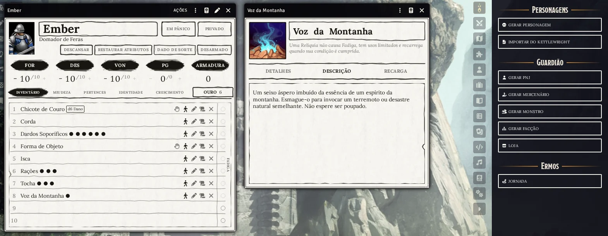

# 🪨 Cairn 2e - Tradução para Português (Brasil)

**Joguem Cairn 2e no Foundry VTT inteiramente em português!**

Este módulo traduz o sistema [Cairn 2e](https://github.com/brunocalado/cairn2e) para o Português
(Brasil): a interface do sistema e todos os compêndios — antecedentes, equipamentos, grimórios,
relíquias, bestiário, mercenários e todas as tabelas do Guardião.



[](https://buymeacoffee.com/mestredigital) [](https://mestredigital.online/pages/projetos-en)

---

# ✨ O que faz diferença

- 📐 **Feito para não quebrar o layout.** Português ocupa mais espaço que inglês. Os nomes de
  itens, monstros e tabelas e os rótulos da ficha foram escritos para caber no mesmo espaço do
  original, e abreviados quando necessário. As fichas, o criador de personagem, a jornada e as
  cicatrizes foram conferidos na tela.
- 🎲 **Nada muda nas regras.** O sistema encontra tudo por id, não por nome. Traduzir não afeta
  nenhuma rolagem, tabela ou automação.
- 📏 **Medidas em metros.** Nos textos, distâncias e pesos estão no sistema métrico
  (10 pés → 3 m, 1 libra → 500 g). Cenas, visão e luz continuam funcionando em pés dentro do
  sistema.
- 🌎 **Pergunta o idioma para você.** Na primeira vez que o módulo carrega, ele oferece mudar o
  idioma do Foundry para Português (Brasil).
- ✨ **Animações em português.** Com o [Automated Animations](https://foundryvtt.com/packages/autoanimations)
  ativo, as armas, os ataques de monstros e as magias com nome em português animam como no
  original.

---

# 🎁 O que é traduzido

### 🖥️ Interface do sistema

Fichas de personagem, PNJ, mercenário e grupo, o criador de personagem, jornada, loja,
cicatrizes, crescimento, facções, cartões de chat, notificações e configurações.

### 📚 Compêndios (via Babele)

| Compêndio | |
|---|---|
| Criação de Personagem | Antecedentes, Tabelas de Antecedentes, Itens de Antecedentes, Companheiros, Características, Vínculos, Presságios |
| Equipamento | Equipamento, Armas, Armaduras |
| Magia | Grimórios, Pergaminhos, Relíquias |
| Referência | Tabelas de Jogo, Bestiário, Mercenários |
| Guardião | Tabelas do Guardião |
| Caseiro | Mais Equipamento, Mais Grimórios, Mais Pergaminhos |

Também são traduzidos os itens dentro dos monstros e mercenários, as pastas dos compêndios e
as macros.

---

# 🧩 Requisitos

- **Sistema:** [Cairn 2e](https://github.com/brunocalado/cairn2e)
- **Obrigatório:** [Babele](https://foundryvtt.com/packages/babele), que exige [libWrapper](https://foundryvtt.com/packages/lib-wrapper)
- **Recomendado:** [Tradução do núcleo para Português (Brasil)](https://github.com/mclemente/fvtt-ptbr-core-translation) — traduz a interface principal do Foundry VTT, que este módulo não cobre.

---

# 🚀 Primeiros passos

1. **Ative o módulo** no seu mundo (o Babele e o libWrapper são ativados junto).
2. **Aceite a mudança de idioma** quando o módulo perguntar. Se preferir, mude depois em
   **Configurações** do Foundry, no campo **Idioma**.
3. Pronto. Os compêndios já abrem em português.

> Cada jogador escolhe o próprio idioma. A pergunta aparece uma vez para cada um.

---

# 📖 Terminologia

A terminologia segue a [tradução de fã do Cairn 2e](https://github.com/robsonfvilela/Cairn-2e-ptbr).

| Inglês | Português |
|---|---|
| Warden | Guardião |
| Background | Antecedente |
| Hit Protection (HP) | Pontos de Guarda (PG) |
| STR / DEX / WIL | FOR / DES / VON |
| Save | Salvaguarda / Teste |
| Fatigue / Deprived | Fadiga / Privado |
| Bulky / Petty | Volumoso / Miudeza |
| Blast | Explosão |
| Enhanced / Impaired | Vantagem / Desvantagem |
| Spellbook / Scroll / Relic | Grimório / Pergaminho / Relíquia |
| Omen / Bond / Scar / Growth | Presságio / Vínculo / Cicatriz / Crescimento |
| Hireling | Mercenário |
| Watch | Turno |
| Die of Fate | Dado de Sorte |

---

# 🛠️ Para o Guardião que cria as próprias tabelas

- **PNJ aleatório:** numa tabela de encontros, uma linha que deve criar uma pessoa nova precisa
  conter a frase **PNJ aleatório**.
- **Encontros:** as linhas começam pela quantidade (`1d6 Lobos`, `2 Bandidos`); sem ela, a linha
  não ganha o botão de pôr na cena.
- **Cicatrizes:** cada linha segue o formato `Título: texto`.
- **Importador do Kettlewright:** as exportações do Kettlewright são em inglês. Num mundo
  traduzido, os itens chegam como itens avulsos e o antecedente não é reconhecido. Isso é
  esperado e não impede a criação do personagem.

---

# 🧰 Manutenção da tradução

Quando o sistema Cairn 2e é atualizado, `tools/translations.mjs` mostra o que ficou para trás
(precisa de Node, e do sistema em `../../systems/cairn2e` ou em `CAIRN_SYSTEM_DIR`):

```bash
node tools/translations.mjs check   # o que é novo, mudou ou saiu do sistema, e o que fere as regras
node tools/translations.mjs todo    # extrai só o inglês a traduzir para tools/work/
node tools/translations.mjs apply   # encaixa a tradução em compendium/ e lang/
```

Os Pergaminhos são gerados a partir dos Grimórios; não é preciso traduzi-los duas vezes.

---

# 🚀 Instalação

Instale pelo navegador de módulos do Foundry VTT ou use este link de manifesto:

```js
https://github.com/brunocalado/cairn2e-ptbr/releases/latest/download/module.json
```

---

# 🙏 Créditos

- [Cairn](https://cairnrpg.com) é um RPG criado por [Yochai Gal](https://newschoolrevolution.com).
- Tradução de referência do Cairn 2e por [robsonfvilela](https://github.com/robsonfvilela/Cairn-2e-ptbr),
  que aproveitou termos da tradução da Primeira Edição feita por [Xenio](https://xenioinabottle.blogspot.com/).

---

# 📜 Licença

* Código: GNU General Public License version 3. Veja `LICENSE`.
* Textos traduzidos do Cairn 2e: [CC-BY-SA 4.0](https://creativecommons.org/licenses/by-sa/4.0/deed.pt-br), a mesma licença do original.
